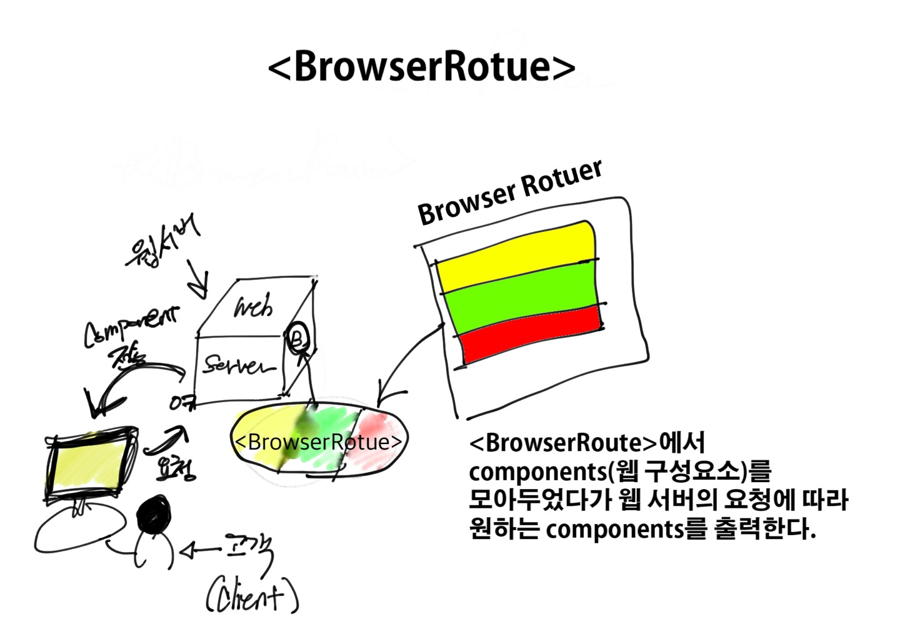

# What I learned today about React router

### written "21.12.12"

---

## Primary Components

### 3 primary categories of components in react router

* routers, like `<BrowerRouter> `and `<HashRouter>`
* route matchers, like` <Route>`and `<Switch>`
* and navigation, like` <Link>, <NavLink>`, and `<Redirect>`

> Point
>> navigation components working like "route changers".
>> all of components must be imported from react-router-dom.

## importants

* At the core of every react Router application shoud be a router components!
* Cause react-router-dom provides `<BrowserRoute> `and `<HashRouter>` routers.

## what's main difference between the` <BrowserRoute>` and `<HashRouter>` ?

* main difference is the way they store the URL and communicate with web server

## about ditails



> `<BrowserRoute> `uses regular URL paths. 
>> these are generally the best-looking URLs
>> But!, they are require your server to be configured correctly ! -> 엄격하다!!
>> Specifically, your web server needs to serve the same page at all URLs that are managed client-side by React Router.
>> Create React App supports this out of the box in development, and comes with instrructions on how to configure your production server as well

> `<HashRouter>` stores the current location in the hash portion of the URL, so the URL looks something like `http://exmaple.com/#your/page`.
>> Since the hash is never sent to the server, this means that no server configuration is needed.
>> -> URL에 다 처박아둔뒤, 하나씩 서버에서 뽑아쓴다! -> 때문에, BrowserRotue보다 속도가 느릴것으로 예상된다! 각각  URL이동전환이 많은 앱에서 쓰일 것 같다만..
>> 굳이..? 애초에 리엑트로 앱만들면서 URL로 직접이동하는 방식을 많이 쓰는 앱은 특정상황에서 쓰일 것 같다.

## Tip!
* To user a router, just make sure it is rendered at the root of your element hierarchy. 
* element hierarchy(계층)을 root에 넣어 랜더링할 때 써라, -> elements 관리할 root 파일 만들어서 한번에 쉽게 관리하셈 ㅇㅇ

* Typically you'll wrap your top-level `<App>` element in a router.

## example

``` javascript 
import React from "react";
import ReactDOM from "react-dom";
import { BrowserRouter } from "react-router-dom";

function App() {
  return <h1>Hello React Router</h1>;
}

ReactDOM.render(
  <BrowserRouter>     // BrowserRotuer에 <App /> component를 넣어줌.
    <App />
  </BrowserRouter>,
  document.getElementById("root")
);
Route Matchers
```

## Route Matchers
* There are two route matching components: Switch and Route. 
* When a `<Switch> ` and Route elements to find one whose `path` matches the current URL. 
* when it finds one. it renders that `<Rotues>` with more specific (typically longer) path **before** less-specific ones.
## ***If*** 
#### no `<Route>` matches, the `<Switch>` renders nothing(null).
---
### example
``` js
import React from "react";
import ReactDOM from "react-dom";
import {
  BrowserRouter as Router,
  Switch,
  Route
} from "react-router-dom";

function App() {
  return (
    <div>
      <Switch>
        {/* If the current URL is /about, this route is rendered
            while the rest are ignored */}
        <Route path="/about">
          <About />
        </Route>

        {/* Note how these two routes are ordered. The more specific
            path="/contact/:id" comes before path="/contact" so that
            route will render when viewing an individual contact */}
        <Route path="/contact/:id">
          <Contact />
        </Route>
        <Route path="/contact">
          <AllContacts />
        </Route>

        {/* If none of the previous routes render anything,
            this route acts as a fallback.

            Important: A route with path="/" will *always* match
            the URL because all URLs begin with a /. So that's
            why we put this one last of all */}
        <Route path="/">
          <Home />
        </Route>
      </Switch>
    </div>
  );
}

ReactDOM.render(
  <Router>
    <App />
  </Router>,
  document.getElementById("root")
);
```

## plus important thing!
* `<Route path>` matches the beginning of the URL, not the whole thing. 
* So a `<Route path="/">` will always match the URL, 
* Because of this, we typically put this `<Route>` last in our `<Switch>`.
* Another possible solution is to use `<Route exact path="/">` which does match the entire URL.
### -> 즉, `<Route path="/">` 요런식으로 라우터 path를 설정해두면, 뒤에붙은 URL의 특정 path값이 맞춰지지 않은이상 `<Route path="/" element="<설정할 엘리먼트 값 />`으로 이동된다.

## Note!
* Although React Router does support rendering `<Route>` elements outside of a `<Switch>` as of version 5.1
* So -> RECOMMAND Thing is 
* Use the `userRtoueMatch hook` instead, 
* Additionally, do not recommand ;
* render a `<Route>` without a path and instead suggest you use a hook to get access to whatever variable you need.
---
# What's different `git fetch` vs `git pull` ?
## `git fetch`
git fetch is the command that tells your local git to retrieve the latest meta-data info from the original (yet doesn’t do any file transferring. It’s more like just checking to see if there are any changes available).

## `git pull`
git pull on the other hand does that AND brings (copy) those changes from the remote repository.
---


## Navigation (or Route Changers)
* React Router provide a `<Link>` component to create links in your application. Wherever you render a `<Link>`, an anchor `(<a>)` will be rendered in your HTML document.

### The `<NavLink>`is a special type of `<Link>` that can style itself as "active" when its to prop matches the current location. 


``` js

<Link to="/">Home</Link>
// <a href="/">Home</>

 // <NavLink> can add motion effect(using acttive) it self
<NavLink to="/react" activeClassName="hurray"> 
React
</NavLink>
// when the URL is /react. this renders:
// <a herf="/react" className="hurray">React</a>

// when it's something else:
// <a href="/react">React</a>

<Redirect to="/login" />
```

* Any time that you want to force navigation, you can render a `<Redirect>`
* when a `<Redirect>`renders, it will navigate useing its to prop.

-----

# Sever Rendering

* Rendering on the server is a bit different since it's all stateless.
* The basic idea is that we wrap the app in stateless `<StaticRotuer>` instead of a `<BrowserRouter>`.
* We pass in the requested url from the server so the routes can match and a context prop we'll discuss next.

### Example
``` javascript
// client
<BrowserRouter>
  <App/>
</BrowserRouter>

// server (not the complete story)
<StaticRouter
  location={req.url}
  context={context}
>
  <App/>
</StaticRouter>
```

* When you render a `<Redirect>` on the client, the browser history changes state and we get the new screen. 
* In a static server environment we can't change the app state.
* Instead, we use the context prop to find out what the result of rendering was.
* If we find a context, url, then we know the app redirected.
* This allows us to send a proper redirect from the server.

``` javascript
const context = {};
const markup = ReactDOMServer.renderToString(
  <StaticRouter location={req.url} context={context}>
    <App />
  </StaticRouter>
);

if (context.url) {
  // Somewhere a `<Redirect>` was rendered
  redirect(301, context.url);
} else {
  // we're good, send the response
}
```

## Adding app specific context information
* The router only ever adds `context.url`. 
* But you may want some redirects to be 301 and others 302.
* Or maybe you'd like aren't authorized. 
* The context prop is yours, So you can mutate it. 
  
### Example about a Way to distinguish between 301 and 302 redirects:

``` javascript
function RedirectWithStatus({ from, to, status }) {
  return (
    <Route
      render={({ staticContext }) => {
        // there is no `staticContext` on the client, so
        // we need to guard against that here
        if (staticContext) staticContext.status = status;
        return <Redirect from={from} to={to} />;
      }}
    />
  );
}

// somewhere in your app
function App() {
  return (
    <Switch>
      {/* some other routes */}
      <RedirectWithStatus status={301} from="/users" to="/profiles" />
      <RedirectWithStatus
        status={302}
        from="/courses"
        to="/dashboard"
      />
    </Switch>
  );
}

// on the server
const context = {};

const markup = ReactDOMServer.renderToString(
  <StaticRouter context={context}>
    <App />
  </StaticRouter>
);

if (context.url) {
  // can use the `context.status` that
  // we added in RedirectWithStatus
  redirect(context.status, context.url);
}
```

---

# What is the `render()` in ReactJS
> React.js library has two components: 

* Class components
* Functional Components

Class components uses render function. The ReactDOM.render() function takes two arguments, HTML code and an HTML element. 

## Purpose of render()

* React renders HTML to the web page by using a function called `render()`.
* The purpose of the function is to display the specified HTML code inside the specified HTML element.
* In the `render()` method, we can read props and state and return our JSX code to the root component of our app.
* In the `render()` method, we cannot change the state, and we cannot cause side effects(such as making an HTTP request to the webserver).

## so point is 
* `render()` method는 pages 내 state와 props를 읽어올 수는 있지만, 변경할 수 는 없다!
* 따라서, 'render()'의 역할은 페이지내에 주어진 state와 props값을 읽어와 page에 display될 variable 값을 생성하는데 쓰인다. 

### shows example 
``` javascript

import React, { Component } from 'react';
export default class App extends Component {
state = {
	PawriDays: [
		{ id: '123s', Day: 'Monday' },
		{ id: '234r', Day: 'Saturday' },
		{ id: '12d5', Day: 'Sunday' }
	]
}

render() {
	const PartyDays = this.state.PawriDays.length
	const style = {
	'textAlign': 'center',
	'color': 'green'
	}

	// Return JSX code
	return (
	<div style={style}>
		<h1>I am User</h1>
		<p> We party: {PartyDays} days a week </p>
	</div>
	);
}
}

```

<a href="https://www.geeksforgeeks.org/explain-the-purpose-of-render-in-reactjs/" alt="What's a render()?">Reference Link</a>
---
## git branch 
### if you want to create a new branch from an existing branch following this steps :)
---
> Example 
> > if I have branch "my-branch" 
> > and I want to create new branch in "my-brnach"
> 1. git checkout "my-branch"
> 2. git checkout -d "new-branch"
> > Second way 
> 1. git checkout -d "new-branch" "my-branch"
___

<a href="https://v5.reactrouter.com/web/guides/server-rendering" alt="Reference">Reference</a>


---
# Code Splitting

### One great feature of the web is that we don't have to make our visitors download the entire app they can use it!

* That means you can splitting as incrementally downloading the app.
* To accomplish this we’ll use webpack, @babel/plugin-syntax-dynamic-import, and loadable-components.
* ---
### Webpac has built-in support for dynamic imports
  
* however, if you are using Babel (e.g., to compile JSX to JavaScript) then you will need to use the @babel

* plugin-syntax-dynamic-import plugin. 
  
* This is a syntax-only plugin, meaning Babel won’t do any additional transformations.
  
* The plugin simply allows Babel to parse dynamic imports so webpack can bundle them as a code split.

### Example

``` Javascript

import loadable from "@loadable/component";
import Loading from "./Loading.js";

const LoadableComponent = loadable(() => import("./Dashboard.js"), {
  fallback: <Loading />
});

export default class LoadableDashboard extends React.Component {
  render() {
    return <LoadableComponent />;
  }
}

```
*  Simply use LoadableDashboard (or whatever you named your component) and it will automatically be loaded and rendered when you use it in your application. 
  
*  The fallback is a placeholder component to show while the real component is loading.

[21.12.14]
# Scroll Restoration

* In earlier versions of React Router we provided out-of-box support for scroll restoration and people have been asking for it ever since.
* Hopefully this document helps you need out of the scroll bar and routing!